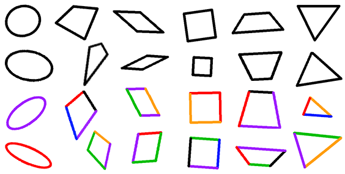
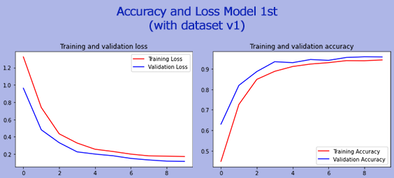
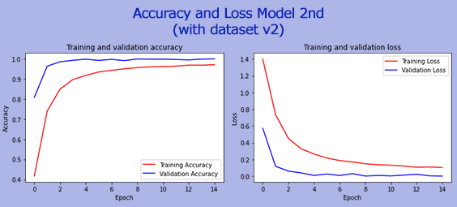

# MathEdu - Ariga
An application to help learn flat shapes covering properties, concepts of perimeter and area. Presented using Artificial Intelligence technology through a guessing game.

## Dataset
 

The dataset spans six classes: circle, kite, parallelogram, square, trapezoid, triangle. Currently (version 2), the dataset consists of 24,000 images.
- Circle: Train(3,000); Val(500); Test(500)
- Kite: Train(3,000); Val(500); Test(500)
- Parallelogram: Train(3,000); Val(500); Test(500)
- Square: Train(3,000); Val(500); Test(500)
- Trapezoid: Train(3,000); Val(500); Test(500)
- Triangle: Train(3,000); Val(500); Test(500)

Collection methodology: Using automation with Python Image Library (PIL)  
Dataset maker: https://github.com/reevald/MathEdu/blob/main/dataset_maker_v2.ipynb  
More info: https://www.kaggle.com/reevald/geometric-shapes-mathematics

## Model Machine Learning
<table>
<tr><th colspan=2>TEST ACCURACY  with 6/1/1 ~ train/val/test</th></tr>
<tr>
  <td>Model V1 with Dataset V1</td>
  <td>Model V2 (improve NN) with Dataset V2</td>
</tr>
<tr>
  <td>99.94%</td>
  <td>99.97%</td>
</tr>
</table>

  
  
